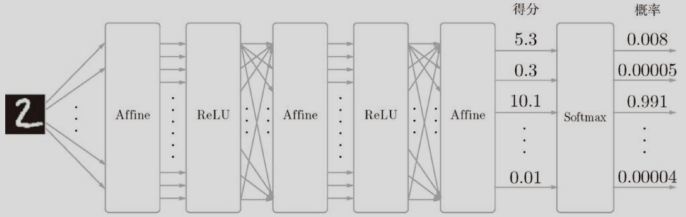

## 1. 概念

- ResNet : 残差网络
- DenseNet : 残差网络的升级版
- Object Detection : 不仅识别类型, 而且要识别出位置
- Transformer : 是一种自然语言处理里面主流的特征提取器
- NumPy : 是做矩阵计算的
- Tensor : 是更高纬度的矩阵
- forward :  前向计算
- backward : 反向传播

## 2. Numpy, PyTorch 语法

| 功能       | Numpy              | Torch                          |
| ---------- | ------------------ | ------------------------------ |
| 内积, 点成 | `x.dot(y)`         | `x.mm(y)`                      |
| 平方       | `np.square(a)`     | `a.pow(2)`                     |
| 矩阵转置   | `x.T`              | `x.t()`                        |
| ReLU       | `np.maximum(h, 0)` | h.clamp(min=0)                 |
| 打印内容   | 可以直接输出       | `x.item()`                     |
| 拷贝一份   | `copy()`           | `clone()`                      |
| GPU 运算   | None               | `x.to("cuda:0")` 或 `x.cuda()` |

## 3. PyTorch 的 Python Api 与 C++ Api

| 功能       | Python Api | C++ Api               |
| ---------- | ---------- | --------------------- |
| debug 打印 | A[0]       | A[0].item().toFloat() |

## 4. 激活函数

神经网络的激活函数必须使用非线性函数。换句话说，激活函数不能使用线性函数。为什么不能使用线性函数呢？因为使用线性函数的话，加深神经网络的层数就没有意义了。线性函数的问题在于，不管如何加深层数，总是存在与之等效的“无隐藏层的神经网络”。

- $sigmoid(x) = \frac{1}{1+e^{-x}}$
  
- $tanh(x) = 2 * sigmoid(2x) - 1 = \frac{1-e^{2x}}{1+e^{-2x}}$
  
- $ReLU(x) = \max(0,x)$
  
- $Swish(x) = x*sigmoid(\beta x)$
  

## 5. 输出层设计

输出层的设计神经网络可以用在分类问题和回归问题上，不过需要根据情况改变输出层的激活函数。一般而言，回归问题用恒等函数，分类问题用 `softmax` 函数。

$y_k = \frac{exp(a_k)}{\sum_i^nexp(a_i)}$

`softmax` 函数, 将网络层输出的数值转化为概率值

## 6. Training

- 为了使神经网络能进行学习，将导入损失函数这一指标。而学习的目的就是以该损失函数为基准，找出能使它的值达到最小的权重参数。
- 神经网络或深度学习则比以往的机器学习方法更能避免人为介入。
- 即利用特征量和机器学习的方法中，特征量仍是由人工设计的，而在神经网络中，连图像中包含的重要特征量也都是由机器来学习的。

## 7. 损失函数 `loss function`

在神经网络的学习中，寻找最优参数（权重和偏置）时，要寻找使损失函数的值尽可能小的参数。为了找到使损失函数的值尽可能小的地方，需要计算参数的导数（确切地讲是梯度），然后以这个导数为指引，逐步更新参数的值。

在进行神经网络的学习时，不能将识别精度作为指标。因为如果以识别精度为指标，则参数的导数在绝大多数地方都会变为0。

神经网络的学习中所用的指标称为损失函数（loss function）。这个损失函数可以使用任意函数，但一般用`均方误差和交叉熵误差`等。

- 均方误差(mean squared error)   $E = \frac{1}{2}\sum(y_k - t_k)^2$
- 交叉熵误差(cross entropy error) $E = -\sum_k t_k \ln(y_k)$
- 其中$y_k$是softmax函数的输出; $t_k$表示label数据, 将正确解标记为1, 错误解标记为0 (即`one-hot 表示`方法)

损失函数是表示神经网络性能的“恶劣程度”的指标，即当前的神经网络对监督数据在多大程度上不拟合，在多大程度上不一致。以“性能的恶劣程度”为指标可能会使人感到不太自然，但是如果给损失函数乘上一个负值，就可以解释为“在多大程度上不坏”，即“性能有多好”。并且，“使性能的恶劣程度达到最小”和“使性能的优良程度达到最大”是等价的，不管是用“恶劣程度”还是“优良程度”，做的事情本质上都是一样的。

## 8. 梯度法

函数的极小值、最小值以及被称为鞍点（`saddle point`）的地方，梯度为0。极小值是局部最小值，也就是限定在某个范围内的最小值。鞍点是从某个方向上看是极大值，从另一个方向上看则是极小值的点。虽然梯度法是要寻找梯度为0的地方，但是那个地方不一定就是最小值（也有可能是极小值或者鞍点）。此外，当函数很复杂且呈扁平状时，学习可能会进入一个（几乎）平坦的地区，陷入被称为“学习高原”的无法前进的停滞期。

虽然梯度的方向并不一定指向最小值，但沿着它的方向能够最大限度地减小函数的值。因此，在寻找函数的最小值（或者尽可能小的值）的位置的任务中，要以梯度的信息为线索，决定前进的方向。

此时梯度法就派上用场了。在梯度法中，函数的取值从当前位置沿着梯度方向前进一定距离，然后在新的地方重新求梯度，再沿着新梯度方向前进，如此反复，不断地沿梯度方向前进。像这样，通过不断地沿梯度方向前进，逐渐减小函数值的过程就是`梯度法`（gradient method）。梯度法是解决机器学习中最优化问题的常用方法，特别是在神经网络的学习中经常被使用。

## 9. 求解梯度的方法

一种是基于 `数值微分` 的方法，另一种方法是通过使用 `误差反向传播法`，即使存在大量的参数，也可以高效地计算梯度。因此，后文将不再使用耗费时间的数值微分，而是使用误差反向传播法求梯度。数值微分的计算很耗费时间，而且如果有误差反向传播法的（正确的）实现的话，就没有必要使用数值微分的实现了。那么数值微分有什么用呢？实际上，在确认误差反向传播法的实现是否正确时，是需要用到数值微分的。

## 10. 随机梯度下降法

为了找到最优参数，我们将参数的梯度（导数）作为了线索。使用参数的梯度，沿梯度方向更新参数，并重复这个步骤多次，从而逐渐靠近最优参数，这个过程称为随机梯度下降法（stochastic gradient descent），简称SGD。

## 11. 学习率

学习率过大的话，会发散成一个很大的值；反过来，学习率过小的话，基本上没怎么更新就结束了。也就是说，设定合适的学习率是一个很重要的问题。

像学习率这样的参数称为`超参数`。这是一种和神经网络的参数（`权重和偏置`）性质不同的参数。相对于神经网络的权重参数是通过训练数据和学习算法自动获得的，学习率这样的超参数则是人工设定的。一般来说，超参数需要尝试多个值，以便找到一种可以使学习顺利进行的设定。

## 12. 神经网络学习步骤

前提 : 神经网络存在合适的权重和偏置，调整权重和偏置以便拟合训练数据的过程称为“学习”。神经网络的学习分成下面4个步骤。

- `步骤1（mini-batch）`从训练数据中随机选出一部分数据，这部分数据称为mini-batch。我们的目标是减小mini-batch的损失函数的值。
- `步骤2（计算梯度）`为了减小mini-batch的损失函数的值，需要求出各个权重参数的梯度。梯度表示损失函数的值减小最多的方向。
- `步骤3（更新参数）`将权重参数沿梯度方向进行微小更新。
- `步骤4（重复）`重复步骤1、步骤2、步骤3。

神经网络的学习按照上面4个步骤进行。这个方法通过梯度下降法更新参数，不过因为这里使用的数据是随机选择的 `mini batch` 数据，所以又称为随机梯度下降法（`stochastic gradient descent`）。“随机”指的是“随机选择的”的意思，因此，随机梯度下降法是“对随机选择的数据进行的梯度下降法”。

## 13. `仿射层（Affine Layer）`

神经网络中的一个`全连接层`。仿射（Affine）的意思是前面一层中的每一个神经元都连接到当前层中的每一个神经元。在许多方面，这是神经网络的「标准」层。仿射层通常被加在卷积神经网络或循环神经网络做出最终预测前的输出的顶层。仿射层的一般形式为

$y = f(W_x + b)$，其中 x 是层输入，w 是参数，b 是一个偏差矢量，f 是一个非线性激活函数。

上图输入图像通过 Affine 层和 ReLU 层进行转换，10个输入通过 Softmax 层进行正规化。在这个例子中，“0”的得分是5.3，这个值经过Softmax层转换为0.008（0.8%）；“2”的得分是10.1，被转换为0.991（99.1%）
