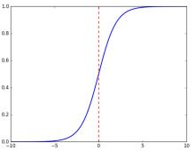
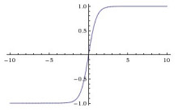
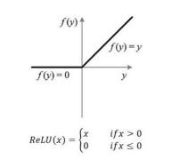

## 变量定义
- ResNet : 残差网络
- DenseNet : 残差网络的升级版
- Object Detection : 不仅识别类型, 而且要识别出位置 
- Transformer : 是一种自然语言处理里面主流的特征提取器
- NumPy : 是做矩阵计算的
- Tensor : 是更高纬度的矩阵

 ## Python, Pytorch 语法

- `z = x.dot(y)` # x 与 y 做内积

## 激活函数

- $sigmoid(x) = \frac{1}{1+e^{-x}}$  

- $tanh(x) = 2 * sigmoid(2x) - 1 = \frac{1-e^{2x}}{1+e^{-2x}}$  

- $ReLU(x) = \max(0,x)$  

- $Swish(x) = x*sigmoid(\beta x)$  
