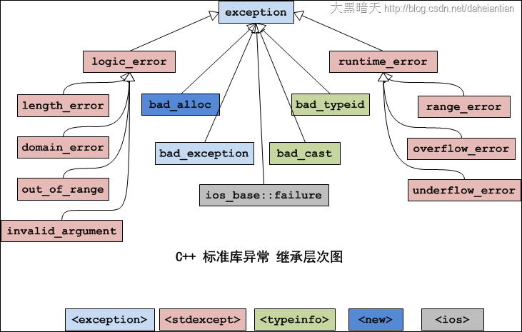

> [https://blog.csdn.net/daheiantian/article/details/6530318](https://blog.csdn.net/daheiantian/article/details/6530318)

## 异常处理的基本思想

- 让一个函数在发现了自己无法处理的错误时抛出（throw）一个异常，然后它的（直接或者间接）调用者能够处理这个问题。
- 也就是《C++ primer》中说的：将问题检测和问题处理相分离。

## 异常为什么好

- 函数的返回值可以忽略，但异常不可忽略。
- 整型返回值没有任何语义信息。而异常却包含语义信息，有时你从类名就能够体现出来。
- 整型返回值缺乏相关的上下文信息。异常作为一个类，可以拥有自己的成员，这些成员就可以传递足够的信息。
- 异常处理可以在调用跳级。这是一个代码编写时的问题：假设在有多个函数的调用栈中出现了某个错误，使用整型返回码要求你在每一级函数中都要进行处理。而使用异常处理的栈展开机制，只需要在一处进行处理就可以了，不需要每级函数都处理。

## C++中使用异常时应注意的问题

- 性能问题。
- 指针和动态分配导致的内存回收问题
- 函数的异常抛出列表
- C++中编译时不会检查函数的异常抛出列表

## 标准库中的异常类




| 异常 | 描述 |
| - | - |
| std::exception | 该异常是所有标准 C++ 异常的父类。 |
| std::bad_alloc | 该异常可以通过 new 抛出。 |
| std::bad_cast | 该异常可以通过 dynamic_cast 抛出。 |
| std::bad_exception | 这在处理 C++ 程序中无法预期的异常时非常有用。 |
| std::bad_typeid | 该异常可以通过 typeid 抛出。 |
| std::logic_error | 理论上可以通过读取代码来检测到的异常。 |
| std::domain_error | 当使用了一个无效的数学域时，会抛出该异常。 |
| std::invalid_argument | 当使用了无效的参数时，会抛出该异常。 |
| std::length_error | 当创建了太长的 std::string 时，会抛出该异常。 |
| std::out_of_range | 该异常可以通过方法抛出，例如 std::vector 和 std::bitset<>::operator[]()。 |
| std::runtime_error | 理论上不可以通过读取代码来检测到的异常。 |
| std::overflow_error | 当发生数学上溢时，会抛出该异常。 |
| std::range_error | 当尝试存储超出范围的值时，会抛出该异常。 |
| std::underflow_error | 当发生数学下溢时，会抛出该异常。 |


## 节选自《The C++ Programming Language》 ——C++之父Bjarne Stroustrup

- 当局部的控制能够处理时，不要使用异常；
- 使用“资源分配即初始化”技术去管理资源；
- 尽量少用try-catch语句块，而是使用“资源分配即初始化”技术。
- 如果构造函数内发生错误，通过抛出异常来指明。
- 避免在析构函数中抛出异常。
- 保持普通程序代码和异常处理代码分开。
- 小心通过new分配的内存在发生异常时，可能造成内存泄露。
- 如果一个函数可能抛出某种异常，那么我们调用它时，就要假定它一定会抛出该异常，即要进行处理。
- 要记住，不是所有的异常都继承自exception类。
- 编写的供别人调用的程序库，不应该结束程序，而应该通过抛出异常，让调用者决定如何处理（因为调用者必须要处理抛出的异常）。
- 若开发一个项目，那么在设计阶段就要确定“错误处理的策略”。

## [C++函数声明后面加throw()的作用！](https://blog.csdn.net/yuhan61659/article/details/81563890)

C++函数后面加关键字throw(something)限制，是对这个函数的异常安全作出限制；这是一种异常规范，只会出现在声明函数时，表示这个函数可能抛出任何类型的异常。

```cpp
void fun() throw();      //表示fun函数不允许抛出任何异常，即fun函数是异常安全的。
void fun() throw(...);    //表示fun函数可以抛出任何形式的异常。
void fun() throw(exceptionType);    // 表示fun函数只能抛出exceptionType类型的异常。

// 举例说明
void GetTag() throw(int);                     // 表示只抛出int类型异常
void GetTag() throw(int，char);         // 表示抛出in，char类型异常
void GetTag() throw();                         // 表示不会抛出任何类型异常
void GetTag() throw(...);                      // 表示抛出任何类型异常
```

## 示例代码

```cpp
#include <iostream>
#include <exception>

const std::string egg = "I not like this number,so I decided to refuse it.";

class non_44_error : public std::logic_error {
public:
    explicit non_44_error(const std::string& s = egg)
        : std::logic_error(s) {
    }
};

void test1(int tmp) {
    throw std::logic_error("hhhh");  // 调用好几层之后, 可以使用异常, 直接跳到catch处理中
}

void tmp_function(int tmp) {
    test1(tmp);
    tmp = 2;
    std::cout << "tmp " << tmp << std::endl;
    return;
}

int main() {
    int input;
    while (1) {
        try {
            std::cout << "Please type in a number between 1 and 100." << std::endl;
            std::cin >> input;
            if (!std::cin.good()) {
                std::cin.clear();
                std::cin.ignore();
                throw std::invalid_argument("The input should be a number!");
            }
            if (input >= 100)
                throw std::length_error("The input should be less than 100!");
            if (input < 0)
                throw std::out_of_range("The input should be Non-negative number!");
            if (input == 44)
                throw non_44_error();
            if (input == 55)
                tmp_function(input);
            std::cout << "Your input is " << input << ". there isn't error\n";
        } catch (std::invalid_argument e) {
            std::cout << "*********************************" << std::endl;
            std::cout << "There is an invalid argument error occured" << std::endl;
            std::cout << "info:" << e.what() << std::endl;
            std::cout << "*********************************" << std::endl;
        } catch (std::length_error e) {
            std::cout << "*********************************" << std::endl;
            std::cout << "There is a length error occured" << std::endl;
            std::cout << "info:" << e.what() << std::endl;
            std::cout << "*********************************" << std::endl;
        } catch (std::out_of_range e) {
            std::cout << "*********************************" << std::endl;
            std::cout << "There is an out of range error occured" << std::endl;
            std::cout << "info:" << e.what() << std::endl;
            std::cout << "*********************************" << std::endl;
        } catch (non_44_error e) {
            std::cout << "*********************************" << std::endl;
            std::cout << "There is an error occured" << std::endl;
            std::cout << "info:" << e.what() << std::endl;
            std::cout << "*********************************" << std::endl;
        } catch (std::logic_error e) {
            std::cout << "*********************************" << std::endl;
            std::cout << "There is an error occured" << std::endl;
            std::cout << "info:" << e.what() << std::endl;
            std::cout << "*********************************" << std::endl;
        } catch (std::exception e) {
            std::cout << "*********************************" << std::endl;
            std::cout << "There is an undefined error occured" << std::endl;
            std::cout << "info:" << e.what() << std::endl;
            std::cout << "*********************************" << std::endl;
        }
        std::cout << std::endl;
    }

    return 0;
}
```
