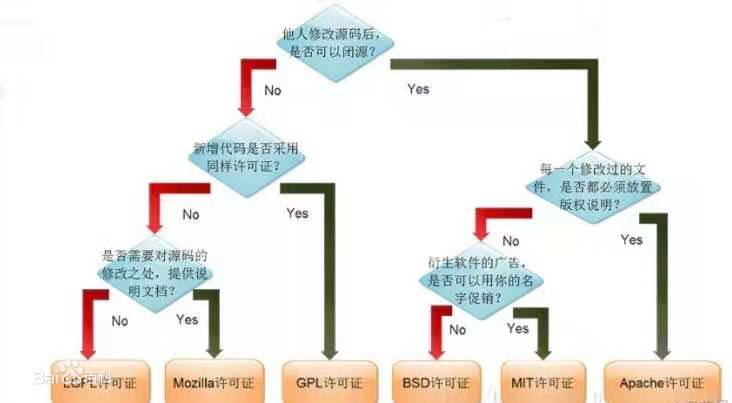

# License分类



## 允许商业集成且没有开源风险的许可证

```log
BSD license
X11 license 即MIT license
FreeBSD
MIT license
Apache license
Openssl license
Zope Public license
boost software license V1
Python license
Zlib license
OpenBSD license
Code Project Open License (CPOL)
```

## 修改后源代码需要公开的许可证

```log
NOSL  V1.0
IBM public license  V 1.0
Sun Public License
Nokia Open Source License
NPL
CDDL
EPL V1
Common Public License V1
Mozilla Public License
Creative Commons Public Domain License
```

## 传染性/商业不友好软件

```log
GNU GPL
Qt Non Commercial License
LGPL
Agent++ license
HP Software license terms
Sun Microsystems,Inc.Software License Agreement
```

### LGPL

LGPL是GPL的一个为主要为类库使用设计的开源协议。和GPL要求任何使用/修改/衍生之
GPL类库的的软件必须采用GPL协议不同。LGPL允许商业软件通过类库引用(link)方式使用LGPL
类库而不需要开源商业软件的代码。这使得采用LGPL协议的开源代码可以被商业软件作为类库引用
并发布和销售。

但是如果修改LGPL协议的代码或者衍生，则所有修改的代码，涉及修改部分的额外代码和衍生
的代码都必须采用LGPL协议。因此LGPL协议的开源代码很适合作为第三方类库被商业软件引用，
但不适合希望以LGPL协议代码为基础，通过修改和衍生的方式做二次开发的商业软件采用。

GPL/LGPL都保障原作者的知识产权，避免有人利用开源代码复制并开发类似的产品.

> [五种开源协议的比较(BSD，Apache，GPL，LGPL，MIT)](http://www.ha97.com/833.html)
